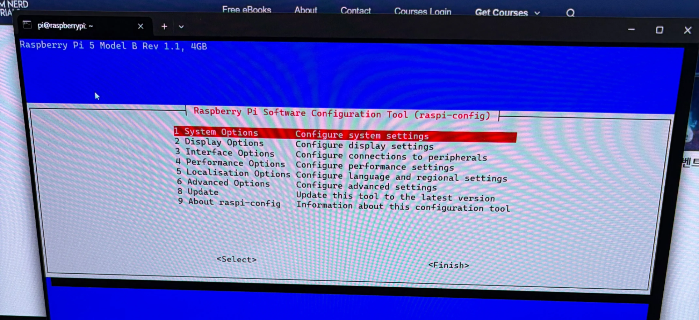
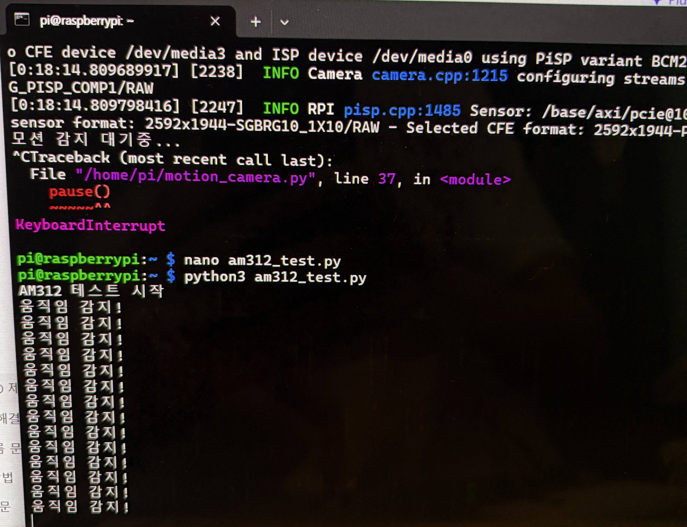
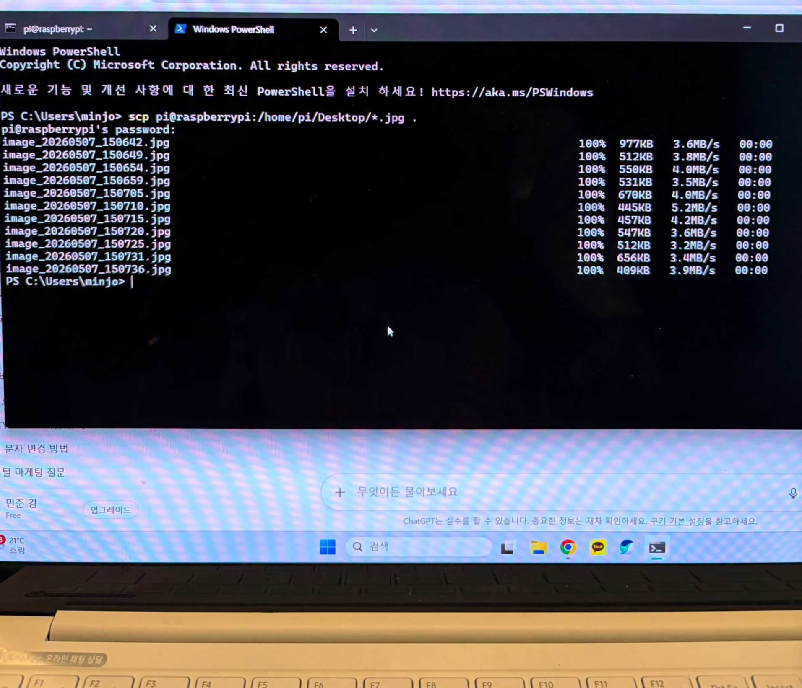

# 📷 Raspberry Pi Motion Detector with Photo Capture

## 1️⃣ 카메라 조립 및 문제 해결

### 첫 번째 문제: 케이블 크기 문제

- FPC 포트의 폭이 맞지 않아 케이블을 교체하였다.

---

### 두 번째 문제: 카메라 활성화 문제

#### 시도 과정

1. VNC를 설치하여 접속 시도
   - 접속 오류 발생

2. `sudo raspi-config` 실행 후 Interface 메뉴 접근
   - Camera 메뉴가 보이지 않음
   - 과정 중 실수로 SSH가 비활성화되어 SD카드 boot 폴더에 `ssh` 파일을 다시 생성함

3. 검색 결과 최신 Raspberry Pi OS에서는 카메라가 자동 활성화된다는 것을 확인함

---

### 세 번째 문제: `libcamera-hello` 실행 시 `command not found`

#### 해결 방법

```bash
sudo apt update
sudo apt install libcamera-apps -y
```

---

### 네 번째 문제: `no cameras available`

#### 해결 과정

1. `rpicam-hello --list-cameras` 명령으로 확인했지만 동일한 문제 발생
2. 하드웨어 문제로 판단하여 아래 작업 진행
   - 금속 접점 방향 변경
   - 케이블 끝까지 삽입
   - 포트 위치 변경

→ `available cameras` 확인 성공

---

### 📷 Interface에 카메라 메뉴가 없는 모습



---

### 📷 command not found 문제


---

### 📷 available cameras 확인 성공


---

### 📷 최종 케이블 및 포트 연결 모습


---

# 🛑 센서 조립 및 문제 해결

### 문제: 움직임 감지가 되지 않는 현상

`python3 am312_test.py` 실행 시 계속 대기 상태 유지

---

### 해결 과정

1. 센서 안정화를 위해 약 1분 정도 대기
2. 강한 움직임 신호를 주었지만 계속 버퍼링 상태 유지
3. 사용한 센서가 AM312로, 기존 HC-SR501 예제 코드와 동작 방식이 다름을 확인
4. AM312에 맞는 코드로 변경

→ 움직임 감지 성공

---

### 🎞️ 1분 대기 후 움직임 테스트 GIF


---

### 📷 변경한 코드로 움직임 감지 성공



---

# 💾 사진 저장 방법

처음에는 boot 폴더에 저장하려고 시도하였다.

→ 저장 오류 발생

원인:
- Raspberry Pi OS의 boot 폴더는 보호되어 있어 쓰기 권한이 제한됨

---

### 해결 방법

SSH를 이용하여 현재 컴퓨터로 이미지 파일을 전송하였다.

```bash
scp pi@raspberrypi:/home/pi/Desktop/*.jpg .
```

---

### 📷 내 컴퓨터로 이미지 저장하는 모습



---

# 🐍 Python 파일 생성

```bash
nano motion_camera.py
```

---

# 💻 코드 작성

```python
from gpiozero import DigitalInputDevice
from picamera2 import Picamera2
from time import sleep
from datetime import datetime

pir = DigitalInputDevice(4)

picam2 = Picamera2()
picam2.configure(picam2.create_still_configuration())
picam2.start()

print("AM312 모션 감지 대기중...")

while True:
    if pir.value:
        print("움직임 감지!")

        filename = datetime.now().strftime(
            "/home/pi/Desktop/image_%Y%m%d_%H%M%S.jpg"
        )

        picam2.capture_file(filename)

        print("사진 저장 완료:", filename)

        sleep(5)

    sleep(0.1)
```

---

### 📷 nano 편집기에서 코드 저장 모습


---

# ▶️ 실행

```bash
python3 motion_camera.py
```

---

### 🎞️ 카메라 동작 GIF


---

# 🖼️ 촬영된 사진 결과

### 📷 사진 1


---

### 📷 사진 2


